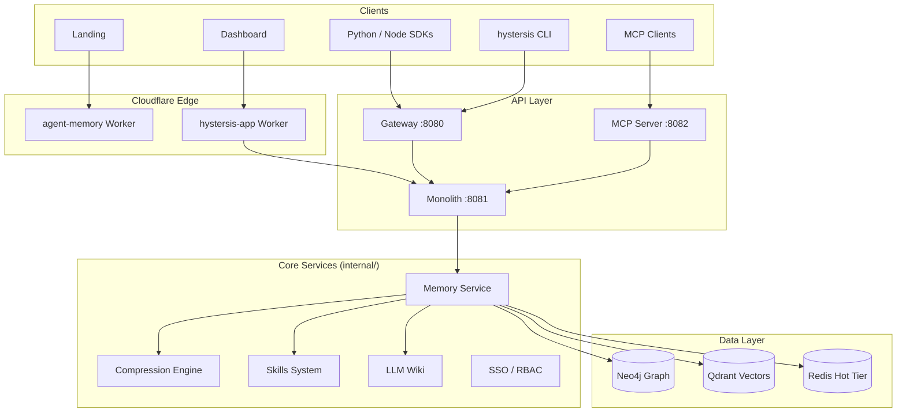

# Hystersis System Architecture

> Production architecture for the Hystersis agent-memory platform.
> Last updated: 2026-06-07

## Overview

Hystersis is a memory infrastructure platform for AI agents. It combines vector search, knowledge graphs, LLM-powered extraction, and a proprietary compression engine to deliver persistent, queryable memory with 85%+ token reduction.

The repository uses a **modular monolith** backend with **multiple deployable frontends** and **SDK clients**. This maps to an enterprise `apps/services/packages` layout without requiring a disruptive restructure.

## Repository Layout (Enterprise Mapping)

| Enterprise Pattern | Hystersis Location | Responsibility |
|-------------------|-------------------|----------------|
| `services/api` | `cmd/server/` | REST API monolith (~212 endpoints) |
| `services/gateway` | `cmd/gateway/` | API gateway / reverse proxy |
| `services/mcp` | `cmd/mcp-server/` | MCP protocol server |
| `services/connectors` | `cmd/connectors/` | Slack, GitHub, Notion integrations |
| `apps/web` | `landing/` | Marketing site (hystersis.com) |
| `apps/admin` | `dashboard/` | Admin UI (app.hystersis.com) |
| `packages/sdk` | `sdk/python/`, `sdk/nodejs/` | Client SDKs |
| `packages/skills` | `skills-npm/` | Skills CLI |
| `infra/docker` | `docker-compose.yml`, `Dockerfile` | Local + container deploy |
| `infra/terraform` | `terraform/` | GCP infrastructure |
| `infra/kubernetes` | `deploy/k8s/`, `deploy/helm/` | K8s manifests |
| `docs/api` | `docs/api-reference/` | Mintlify API reference |
| `docs/agents` | `api/agents.md` | Agent integration guide |

## System Design

## Data Flow

### Memory Write Path

1. Client sends content via `POST /memories` or conversation extraction
2. **Memory Processor** (`internal/memory/processor.go`) extracts facts via LLM
3. Entities linked in **Neo4j** knowledge graph
4. Embeddings stored in **Qdrant**
5. **Compression Pipeline** (`internal/compression/pipeline/`) compresses asynchronously
6. **Tier Router** (`internal/memory/tier/`) routes to Working → Hot (Redis) → Cold (Neo4j+Qdrant)

### Memory Read Path

1. Query arrives via `GET /search` or `GET /search/enhanced`
2. **Vector search** retrieves top-K candidates from Qdrant
3. **Spreading Activation** (`internal/compression/retrieval/`) propagates through graph (3 hops, 0.85 decay)
4. Optional **reranker** (Cohere + LLM) reorders results
5. Results returned with source attribution and activation metadata

## Service Boundaries

| Service | Port | Auth | Scope |
|---------|------|------|-------|
| Gateway | 8080 | API key / session | Routes to downstream |
| Monolith | 8081 | API key / OAuth / session | All memory + admin APIs |
| MCP Server | 8082 | OAuth | Tool calls → memory API |
| Connectors | 8083 | Webhook secrets | External integrations |
| Dashboard | 443 | Better Auth | Proxies to monolith |

## API Surface

Core endpoint groups (see `cmd/server/api.go`):

- **Memory**: `/memories`, `/search`, `/search/enhanced`, `/search/hybrid`
- **Graph**: `/entities`, `/graph`
- **Compression**: `/compression/stats`, `/compression/mode`, `/tier/policy`
- **Skills**: `/skills`, `/chains`, `/reviews`
- **Admin**: `/admin/users`, `/admin/invites`, `/admin/api-keys`
- **Auth**: `/auth/login`, `/auth/register`, OAuth providers
- **Wiki**: `/wiki/ingest`, `/wiki/query`, `/wiki/pages`

Full reference: [hystersis.com/docs/api-reference](https://hystersis.com/docs/api-reference/overview)

## Agent Flows

Hystersis supports multiple agent integration patterns:

| Pattern | Entry Point | Use Case |
|---------|-------------|----------|
| REST SDK | `sdk/python`, `sdk/nodejs` | Application integration |
| MCP | `cmd/mcp-server` | Claude Desktop, Cursor |
| CLI REPL | `cmd/agent` | Interactive development |
| Skills | `skills-npm` | Procedural memory patterns |

Recommended agent loop:

1. **Planner** — decompose task, query memory for context
2. **Research** — `GET /search/enhanced?mode=spreading`
3. **Execution** — perform action, `POST /memories` with `skip_processing` option for raw logs
4. **Memory** — async compression extracts durable facts
5. **Evaluation** — `POST /api/v1/benchmark/*` or custom eval hooks
6. **Critic** — conflict resolution via `ResolveConflict` template

## Event Flows

- **Webhooks** (`internal/webhook/`) — outbound events on memory CRUD, skill approval
- **SSE** — `GET /events` for real-time dashboard updates
- **Audit** (`internal/audit/`) — middleware logs admin actions
- **Stripe** — `POST /stripe/webhook` for billing events

## Security Model

| Layer | Implementation |
|-------|---------------|
| Authentication | API keys, session cookies, OAuth (Google/GitHub), SSO (OIDC/SAML/LDAP) |
| Authorization | RBAC (`internal/roles/`) with scope middleware |
| Rate limiting | Per-IP and per-key limiters in `cmd/server/api.go` |
| Audit | Full audit log middleware |
| Encryption | TLS in transit; secrets via env vars / Cloudflare secrets |
| OWASP | Input validation, safe error responses (`safeHTTPError`), no credential exposure in UI |

## Scaling Strategy

| Tier | Component | Scale Approach |
|------|-----------|----------------|
| Edge | Cloudflare Workers | Auto-scale globally |
| API | Monolith | Horizontal pods (K8s/Cloud Run), stateless |
| Graph | Neo4j | Vertical + read replicas |
| Vectors | Qdrant | Sharding by tenant, collection per namespace |
| Hot cache | Redis | Cluster mode for tiered memory |
| Compression | Async workers | Background job queue, 4-8 workers |

Target: P95 search latency <200ms, write impact <5ms (async compression).

## Deployment Topology

| Environment | Landing | Dashboard | API |
|-------------|---------|-----------|-----|
| Production | `hystersis.com` (CF Worker) | `app.hystersis.com` (OpenNext CF) | `api.hystersis.com` |
| Local | `localhost:5173` | `localhost:3000` | `localhost:8080/8081` |
| Docker | — | — | `docker-compose up` |

Deploy pipeline: `wrangler.jsonc` → `scripts/build-cloudflare.sh` → landing + docs + dashboard.

## Observability

- **Metrics**: `GET /metrics` (Prometheus format)
- **Health**: `GET /health`, `GET /ready`
- **Dashboards**: `deploy/grafana/`
- **Structured logs**: `internal/logger`
- **Compression stats**: `GET /compression/stats`

## Testing Strategy

| Layer | Location | Target |
|-------|----------|--------|
| Unit | `internal/*_test.go` | Package-level logic |
| Integration | `tests/integration_test.go` | Neo4j + Qdrant + Redis |
| E2E | `cmd/server/e2e_test.go` | Full API flows |
| Production verify | `scripts/verify-production.sh` | Post-deploy smoke tests |
| CI | `.github/workflows/ci.yml` | Build + test + lint on every PR |

## Related Documents

- [AGENTS.md](../AGENTS.md) — Developer guide and implementation status
- [docs/decisions/](./decisions/) — Architecture Decision Records
- [DEPLOYMENT.md](../DEPLOYMENT.md) — Deployment procedures
